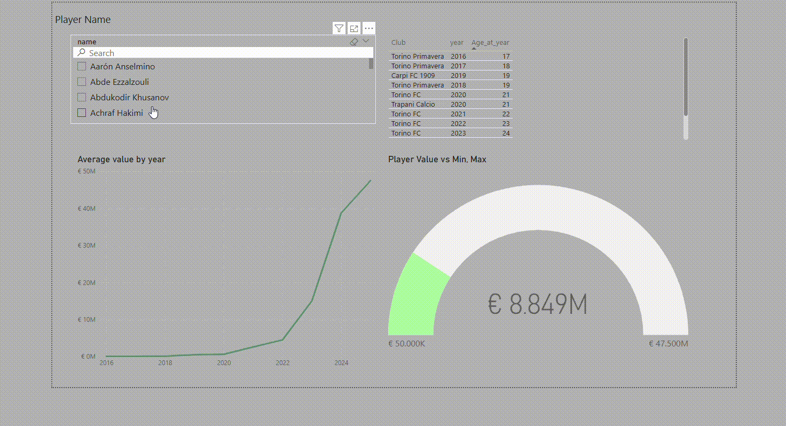
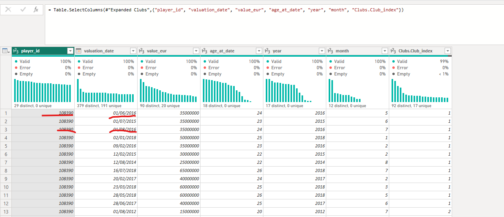
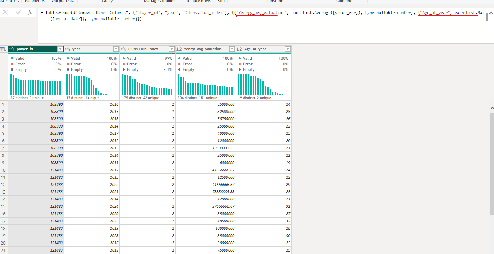
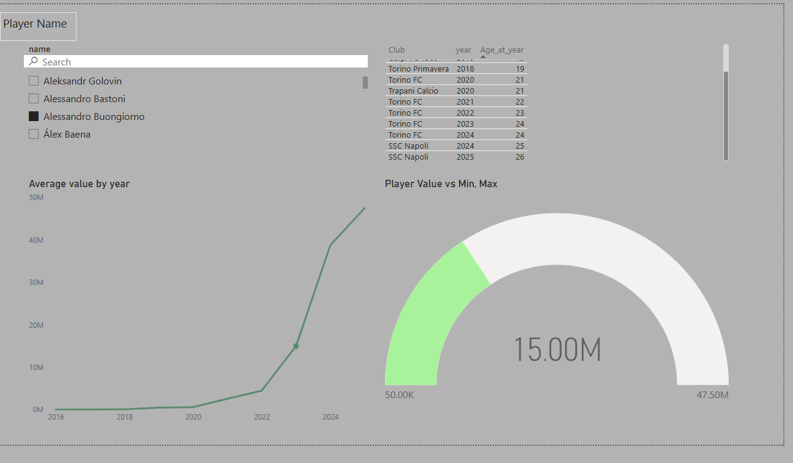
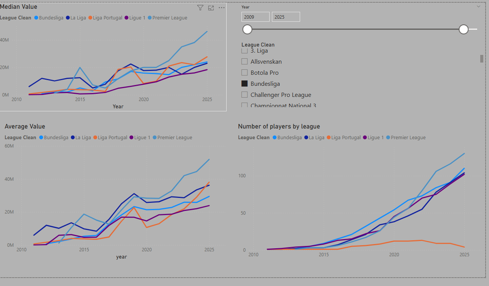

# 📈 Kaggle Players Visualisation

## 📖 About
Exploratory analysis of players dataser 

---

## 🚀 Keeping the long story short (TL;DR)
> [!IMPORTANT]
> Showing the importance of detailed visualisation of dataset and how simple measures badly affect your opinion

---

## 📊 Data set itsels

> Analyzed Data Set concerns selected sample of players. I' ve created some measures to make analysis easier and more meaningfull. Moreover I wanted to show the importance of validation, and critical thinking when it comes to basic statistical measures interpretaion.

### 1. Data Cleaning and modeling

> The first "quality" issue that I spotted was related to irregular evaluation of selected players during a year.
> Vaule of some players were evaluated once a year wherease value of the others were evaluated 6 times a years, what could make comparisons unfair.

> To overcome that issue I ' ve decided to aggregate the players valuation in a year perioids using max value as aggregation measure.

### 2. Final Visualisation

> Front page of players visualisation dashboard below

> Picture below shows the importance of detailed analysis of dataset that you are dealing with.
> Relaying just on basics simple statistical parameters like mean and average could lead to wrong conclusions
For example the average value of Portugeese clubs players is similar to the value of players playing in Budesliga or Serie A, but it's worth to highlight ther significant less players from Portugeese league are present in analyzed dataset than 

---

  Created with ☕ and data 

